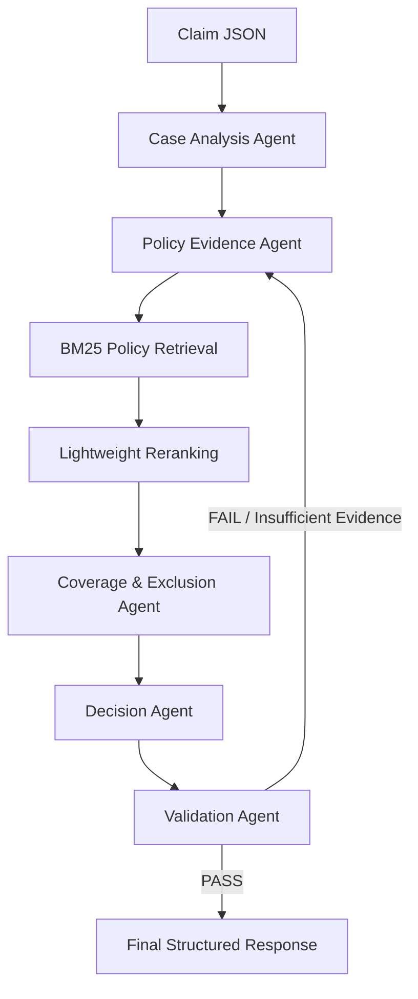

# Architecture Design Note: Policy-Aware Multi-Agent RAG Claim Decision Engine

## Executive Overview

The **Policy-Aware Multi-Agent RAG Claim Decision Engine** is an evidence-grounded health insurance claim adjudication system designed for the Aptino AI Engineer Assignment.

The engine operates on the supplied authoritative policy document:

**USGIC - CSC Individual Health Insurance (Policy Wording UNIHLIP18004V011718)**

The system uses a **5-agent LangGraph state machine**, policy-document retrieval, evidence-grounded decision synthesis, citation validation, financial limit calculation, and explicit abstention mechanisms such as `NEEDS_REVIEW` and `INSUFFICIENT_EVIDENCE`.

For the memory-constrained cloud deployment, the production retrieval pipeline uses **BM25 sparse retrieval with lightweight ranking** rather than loading large dense embedding and Cross-Encoder models.

---

# 1. Multi-Agent Boundaries & LangGraph Workflow

Rather than delegating the complete adjudication process to a single prompt, the engine decomposes claim processing into five specialized agent nodes that exchange structured state.



## Agent Responsibilities & State Contracts

### 1. Case Analysis Agent

**Implementation:** `agents/case_analysis_agent.py`

**Role:**

* Scans the claim input.
* Extracts patient, hospital, diagnosis, procedure, timing, and document information.
* Identifies relevant decision dimensions.

**Decision dimensions include:**

* Initial waiting period
* Pre-existing diseases
* Policy sublimits
* Exclusions
* Hospital eligibility
* Required evidence

**Output:**

* Structured claim facts
* Missing document indicators
* Investigation dimensions

---

### 2. Policy Evidence Agent

**Implementation:** `agents/policy_evidence_agent.py`

**Role:**

Executes targeted policy retrieval queries for the decision dimensions identified by the Case Analysis Agent.

The deployed implementation uses **BM25 sparse lexical retrieval** over hierarchical policy chunks.

**Output:**

* Relevant policy clauses
* Physical PDF page numbers
* Section names
* Unique chunk IDs
* Retrieval metadata

Example retrieval metadata:

```json
{
  "dense_hits": 0,
  "bm25_hits": 70,
  "rrf_candidates": 70,
  "reranked_top_k": 8,
  "top_score": 1.4195
}
```

`dense_hits = 0` is expected in the current lightweight deployment because dense retrieval is disabled to reduce memory consumption.

---

### 3. Coverage & Exclusion Agent

**Implementation:** `agents/coverage_exclusion_agent.py`

**Role:**

Evaluates the retrieved policy evidence against the claim.

The agent considers applicable policy conditions including:

* Initial waiting period
* Pre-existing disease waiting period
* Specific disease waiting periods
* Exclusions
* Hospitalization conditions
* Room-rent limits
* ICU limits
* Other applicable financial sublimits

**Output:**

A structured coverage assessment containing:

* Coverage status
* Applicable exclusions
* Financial deductions
* Payable amount
* Supporting evidence

---

### 4. Decision Agent

**Implementation:** `agents/decision_agent.py`

**Role:**

Synthesizes the case analysis, retrieved policy evidence, coverage evaluation, and applicable limits into the final adjudication status.

The response is returned as a machine-readable JSON structure containing:

* Decision
* Confidence
* Key findings
* Applicable limits
* Missing evidence
* Policy citations
* Retrieval metadata
* Execution trace

---

### 5. Validation Agent

**Implementation:** `agents/validation_agent.py`

**Role:**

Acts as an independent evidence-grounding audit layer.

It checks whether generated policy claims are supported by the retrieved policy evidence.

**Output:**

```text
PASS
```

or

```text
FAIL
```

If required evidence cannot be sufficiently supported, the workflow can return to the evidence retrieval stage or produce an abstention decision.

---

# 2. Policy Retrieval Architecture

## 2.1 Policy Ingestion

The policy PDF is processed dynamically rather than relying on manually copied policy text.

```text
Policy PDF
    ↓
PolicyPDFParser
    ↓
Physical Page Extraction
    ↓
PolicyChunker
    ↓
Hierarchical Policy Chunks
    ↓
BM25 Index
```

The supplied policy document currently produces **162 hierarchical policy chunks** during indexing.

---

## 2.2 Hierarchical Policy Chunking

The `PolicyChunker` organizes policy text into structured chunks containing information such as:

* Chunk ID
* Source document
* Physical page
* Section
* Clause
* Content
* Keywords

Example:

```json
{
  "chunk_id": "CH-P07-01",
  "source": "USGIC-CSCIndividualHealthInsurance_2017-2018.pdf",
  "page": 7,
  "section": "SCOPE OF COVER & LIMITS"
}
```

This structure allows final decisions to remain traceable to the original policy document.

---

## 2.3 Sparse Retrieval

The production deployment uses **BM25Okapi** through the `rank_bm25` package.

BM25 provides lexical retrieval over the policy chunks without requiring large neural embedding models.

The Policy Evidence Agent executes multiple targeted queries covering different claim dimensions.

For example:

```text
Room rent
Waiting period
Pre-existing disease
Hospital eligibility
Exclusions
Ambulance limits
Other applicable sublimits
```

The resulting candidates are deduplicated and ranked before being passed to the Coverage & Exclusion Agent.

---

## 2.4 Lightweight Ranking

The production deployment uses a lightweight ranking layer instead of loading the original Cross-Encoder model.

The ranking combines the available retrieval score with keyword-overlap information to prioritize relevant policy clauses.

This design significantly reduces memory requirements while preserving an inspectable retrieval pipeline suitable for the constrained cloud environment.

---

# 3. Memory-Constrained Deployment Design

The initial architecture included dense retrieval components such as:

```text
SentenceTransformer
ChromaDB
Cross-Encoder
PyTorch
```

However, loading these components exceeded the memory available on the Render free deployment environment.

The production implementation therefore removes those heavyweight runtime dependencies and uses:

```text
FastAPI
    ↓
LangGraph
    ↓
BM25
    ↓
Lightweight Reranking
    ↓
Policy Evidence
    ↓
Decision + Validation
```

This allows the complete adjudication API to operate within the available deployment memory.

The deployed backend is available through the Render-hosted FastAPI service, while the user-facing interface is provided through Streamlit.

---

# 4. Confidence Computation

The confidence score is an **evidence-grounded heuristic**, not a calibrated probability.

The system considers observable evidence signals such as:

| Signal                     | Effect                              |
| -------------------------- | ----------------------------------- |
| Retrieval/ranking strength | Supports confidence                 |
| Supporting policy evidence | Supports confidence                 |
| Validation status          | PASS supports confidence            |
| Missing evidence           | Reduces confidence                  |
| Contradictory evidence     | Reduces confidence                  |
| Abstention conditions      | Can substantially reduce confidence |

The implementation does not treat the LLM's generated confidence as an independent probability estimate.

When required evidence is unavailable or contradictory, the system can reduce confidence and route the case toward `NEEDS_REVIEW` or `INSUFFICIENT_EVIDENCE`.

---

# 5. Evidence Grounding & Citation Validation

A core design principle is that policy-related claims should be traceable to retrieved policy evidence.

Each citation can contain:

```text
Claim
Source document
Physical page
Section
Chunk ID
```

Example:

```text
Claim:
Room rent and hospital charges subject to daily sub-limits.

Source:
USGIC-CSCIndividualHealthInsurance_2017-2018.pdf

Page:
7

Section:
SCOPE OF COVER & LIMITS

Chunk ID:
CH-P07-01
```

The Validation Agent checks generated claims against the available evidence before the final response is returned.

---

# 6. Abstention and Safety Mechanism

The system is designed not to force a decision when required evidence is unavailable.

Potential outcomes include:

```text
ADMISSIBLE
ADMISSIBLE_WITH_LIMITS
PARTIALLY_ADMISSIBLE
NOT_ADMISSIBLE
NEEDS_REVIEW
INSUFFICIENT_EVIDENCE
```

Abstention can occur when:

* Required policy evidence is missing.
* Required claim documentation is unavailable.
* Hospital eligibility cannot be verified.
* Retrieved clauses are contradictory.
* A generated claim cannot be adequately grounded in policy evidence.

This provides a controlled fallback instead of presenting unsupported policy conclusions as certain.

---

# 7. Example End-to-End Execution

For a claim such as `PUB-001`:

```text
Claim JSON
    ↓
CaseAnalysisAgent
    ↓
PolicyEvidenceAgent
    ↓
7 targeted policy retrieval dimensions
    ↓
BM25 Retrieval
    ↓
Candidate Ranking
    ↓
CoverageExclusionAgent
    ↓
Financial Limit Calculation
    ↓
DecisionAgent
    ↓
ValidationAgent
    ↓
Structured Decision
```

Example deployed result:

```text
Decision:
ADMISSIBLE_WITH_LIMITS

Confidence:
100%

Validation:
PASS

Payable:
INR 153000
```

Applied deductions included:

```text
Room Rent Deduction:
INR 10000

Ambulance Deduction:
INR 200
```

The result also included an inspectable policy citation pointing to page 7 of the supplied policy document.

---

# 8. Known Limitations

### 1. Strict Policy Boundary

The system reasons over the supplied policy document and does not independently establish external medical or insurance rules.

### 2. PDF Extraction Dependency

OCR and text extraction quality can affect retrieval when source documents contain complex layouts, scanned pages, or unusual formatting.

### 3. Heuristic Confidence

The confidence value is evidence-grounded but is not a statistically calibrated probability.

### 4. Lightweight Production Retrieval

The deployed cloud configuration uses BM25 and lightweight ranking rather than large neural retrieval models because of memory constraints.

### 5. LLM Dependency

Live Gemini reasoning depends on API availability and configured credentials. A deterministic fallback is available for selected rule-based scenarios.

### 6. Human Review

The system is designed as a decision-support engine. Cases with insufficient or contradictory evidence can be routed to `NEEDS_REVIEW` rather than forcing an unsupported automated decision.

---

# 9. Design Principles

The architecture follows these principles:

1. **Policy-first reasoning**
2. **Evidence before decision**
3. **Inspectable citations**
4. **Explicit financial-limit calculation**
5. **Validation before final output**
6. **Abstention when evidence is insufficient**
7. **Structured machine-readable outputs**
8. **Memory-aware production deployment**
9. **No unsupported policy claims**
10. **No private chain-of-thought exposure**
