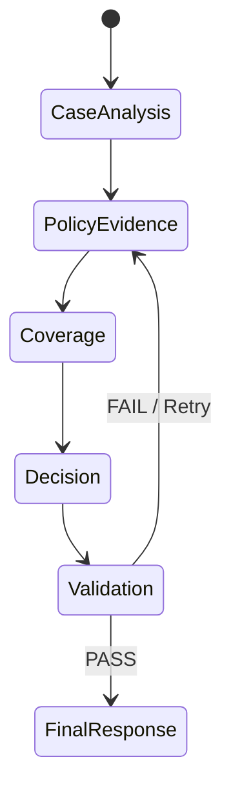
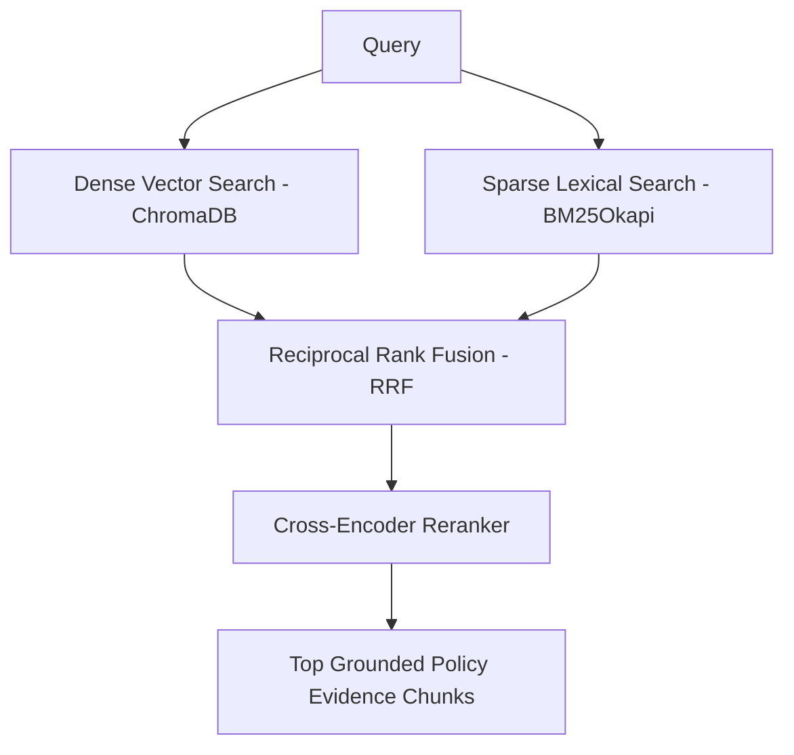

# Architecture Design Note: Policy-Aware Multi-Agent RAG Claim Decision Engine

## Executive Overview

The **Policy-Aware Multi-Agent RAG Claim Decision Engine** is a production-grade AI system designed for evidence-grounded health insurance claim adjudication. It strictly operates on the authoritative policy document *USGIC - CSC Individual Health Insurance (Policy Wording UNIHLIP18004V011718)*. 

The system relies on a 5-agent **LangGraph state machine architecture**, a **Hybrid RAG retrieval pipeline** (Dense ChromaDB + Sparse BM25 + Reciprocal Rank Fusion + Cross-Encoder Reranking), automated **citation grounding validation**, and strict **abstention mechanisms** (`NEEDS_REVIEW` / `INSUFFICIENT_EVIDENCE`).

---

## 1. Multi-Agent Boundaries & LangGraph Workflow

Rather than delegating decision-making to a single prompt, the engine decomposes claim adjudication into 5 specialized agent nodes exchanging structured state:

### Agent Responsibilities & State Contracts

1. **Case Analysis Agent (`agents/case_analysis_agent.py`)**
   - **Role**: Scans claim input (patient, hospital, diagnosis, procedure, timing, documents).
   - **Output**: Structured facts object, missing document alerts, and multi-dimension investigation plan (`initial_waiting_period`, `pre_existing_diseases`, `sublimits`, `exclusions`, `hospital_criteria`).

2. **Policy Evidence Agent (`agents/policy_evidence_agent.py`)**
   - **Role**: Dispatches targeted hybrid RAG queries for each dimension.
   - **Output**: Top deduplicated policy clauses with exact physical page numbers (`page`), section titles (`section`), unique chunk IDs (`chunk_id`), and retrieval metadata (`dense_hits`, `bm25_hits`, `rrf_candidates`, `reranked_top_k`, `top_score`).

3. **Coverage & Exclusion Agent (`agents/coverage_exclusion_agent.py`)**
   - **Role**: Evaluates coverage scope, 30-day initial waiting period, 48-month PED waiting period, specific disease waiting periods (with portability credits), exclusions, and financial sublimits.
   - **Output**: Financial calculation breakdown (room rent caps 1% SI/day, ICU caps 2% SI/day, doctor fee caps 25% SI, medicine caps 40% SI, ambulance caps) and net payable amount.

4. **Decision Agent (`agents/decision_agent.py`)**
   - **Role**: Synthesizes findings into one of 5 canonical statuses (`ADMISSIBLE`, `ADMISSIBLE_WITH_LIMITS`, `PARTIALLY_ADMISSIBLE`, `NOT_ADMISSIBLE`, `NEEDS_REVIEW`).
   - **Output**: Machine-readable response payload, inspectable policy citations, and multi-signal confidence estimation.

5. **Validation Agent (`agents/validation_agent.py`)**
   - **Role**: Independent auditor verifying citation text grounding against retrieved policy chunks.
   - **Output**: `PASS` or `FAIL`. On citation failure or evidence ambiguity, forces abstention to `NEEDS_REVIEW`.

---

## 2. Hybrid Retrieval Architecture (Dense + Sparse + RRF + Reranker)

- **Dynamic Page Parsing**: `PolicyPDFParser` extracts physical PDF page numbers (1-indexed).
- **Hierarchical Clause Chunker**: `PolicyChunker` parses definitions, scope of cover, exclusions, and claims procedure into 162 structured chunks.
- **Reciprocal Rank Fusion (RRF)**: Combines dense and sparse ranks using:
  $$\text{score}(d) = \sum \frac{1}{60 + \text{rank}(d)}$$
- **Cross-Encoder Reranker**: `cross-encoder/ms-marco-MiniLM-L-6-v2` re-weights top RRF candidates.

---

## 3. Confidence Computation

The confidence score is derived from multiple observable signals rather than an arbitrary LLM value:

| Signal | Contribution | Description |
|---|---|---|
| **Cross-encoder reranker score** | 40% | Primary semantic & lexical retrieval strength |
| **Supporting policy clause count** | 30% | Number of relevant clauses retrieved |
| **Validation & Evidence Sufficiency** | 30% | `PASS` status adds 30%; missing evidence or `NEEDS_REVIEW` applies severe penalties |

If evidence is insufficient, confidence is intentionally reduced and the decision becomes `NEEDS_REVIEW`.

---

## 4. Known Limitations

1. **Strict Policy Boundaries**: System only reasons over the supplied policy PDF and intentionally ignores external medical or insurance knowledge.
2. **Text Extraction Reliance**: OCR/text extraction accuracy depends on the underlying PDF layout quality.
3. **Heuristic Confidence**: Confidence is evidence-grounded and heuristic rather than a calibrated probability distribution.
4. **Deterministic Fallback**: Local deterministic pipeline guarantees reproducible offline evaluation but has fixed heuristic branching compared to live Gemini LLM calls.
5. **Strict Abstention**: System abstains (`NEEDS_REVIEW`) whenever required hospital registration criteria or critical medical documentation is unverified.
