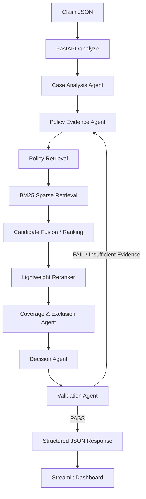
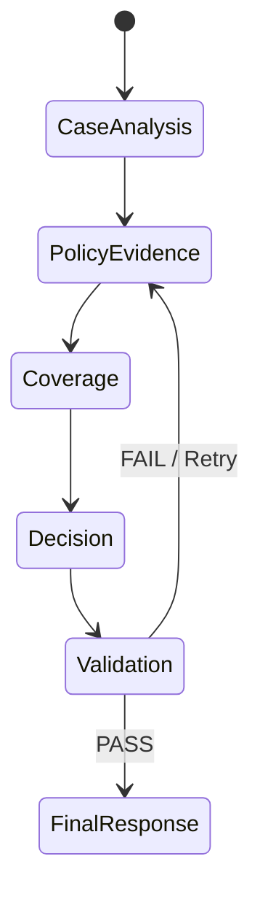

# Policy-Aware Multi-Agent RAG Claim Decision Engine

An evidence-grounded health insurance claim adjudication engine built for the **Aptino AI Engineer Assignment**.

The system uses a **LangGraph multi-agent architecture**, policy-document retrieval, evidence-grounded decision making, citation validation, and explicit abstention mechanisms such as `NEEDS_REVIEW` and `INSUFFICIENT_EVIDENCE`.

### 🌐 Live Demo

* **Streamlit Dashboard:** https://aptino-claim-engine.streamlit.app/
* **FastAPI Backend:** https://aptino-claim-engine-api.onrender.com/
* **API Documentation:** https://aptino-claim-engine-api.onrender.com/docs
* **GitHub Repository:** https://github.com/Tajiya3030/aptino-policy-aware-multi-agent-rag-claim-engine

---

## 🏛️ System Architecture



### LangGraph Shared State



The workflow separates claim analysis, policy evidence retrieval, coverage evaluation, decision synthesis, and validation into distinct agents.

---

## 🤖 Multi-Agent Workflow

### 1. CaseAnalysisAgent

Extracts relevant claim facts and maps them to decision dimensions such as:

* Coverage
* Exclusions
* Policy limits
* Waiting periods
* Required evidence

### 2. PolicyEvidenceAgent

Executes targeted policy retrieval queries against the supplied insurance policy and identifies relevant clauses.

### 3. CoverageExclusionAgent

Evaluates whether the treatment is covered and applies relevant exclusions, waiting periods, and policy conditions.

### 4. DecisionAgent

Synthesizes the retrieved evidence and produces a structured adjudication decision.

Possible decisions include:

```text
ADMISSIBLE
ADMISSIBLE_WITH_LIMITS
NOT_ADMISSIBLE
NEEDS_REVIEW
INSUFFICIENT_EVIDENCE
```

### 5. ValidationAgent

Performs an evidence-grounding audit to check whether generated claims are supported by retrieved policy evidence.

Unsupported claims can trigger another evidence-retrieval cycle rather than being silently accepted.

---

## 🔎 Retrieval Architecture

The original design explored a hybrid dense + sparse retrieval pipeline.

For the **memory-constrained cloud deployment**, the production backend uses a lightweight retrieval configuration:

```text
Policy PDF
    ↓
PDF Extraction
    ↓
Hierarchical Policy Chunking
    ↓
BM25 Retrieval
    ↓
Candidate Ranking
    ↓
Lightweight Keyword/RRF-Based Reranking
    ↓
Policy Evidence
```

### Why the deployed version uses lightweight retrieval

The Render free deployment provides a constrained memory environment. Loading large PyTorch/SentenceTransformer/Cross-Encoder dependencies caused excessive memory consumption.

The deployed implementation therefore removes:

* ChromaDB
* SentenceTransformer model loading
* CrossEncoder model loading
* Large PyTorch/CUDA dependencies

and uses:

* `rank_bm25`
* CPU-only Python components
* Lightweight ranking heuristics

This allows the complete FastAPI adjudication pipeline to run successfully on the deployed low-memory instance.

---

## 🛠️ Technology Stack

| Component           | Technology                              |
| ------------------- | --------------------------------------- |
| Agent orchestration | LangGraph                               |
| Shared state        | Typed state / Pydantic                  |
| Policy parsing      | PyPDF                                   |
| Sparse retrieval    | BM25Okapi                               |
| Ranking             | Lightweight RRF/keyword-overlap ranking |
| LLM                 | Gemini via `google-genai`               |
| Backend             | FastAPI + Uvicorn                       |
| Frontend            | Streamlit                               |
| Validation          | Evidence/citation audit                 |
| Testing             | Pytest                                  |
| Backend deployment  | Render                                  |
| Frontend deployment | Streamlit Cloud                         |

---

## 📁 Repository Structure

```text
aptino-policy-aware-multi-agent-rag-claim-engine/

│
├── README.md
├── ARCHITECTURE.md
├── requirements.txt
├── .env.example
├── Dockerfile
├── render.yaml
│
├── backend/
│   └── FastAPI REST API
│
├── agents/
│   └── LangGraph multi-agent workflow
│
├── rag/
│   ├── PDF ingestion
│   ├── policy chunking
│   ├── BM25 retrieval
│   ├── hybrid retrieval interface
│   └── lightweight reranking
│
├── frontend/
│   └── Streamlit dashboard
│
├── evaluation/
│   └── benchmark harness and reports
│
├── deployment/
│   ├── Dockerfile
│   └── deployment requirements
│
├── tests/
│   ├── test_rag
│   ├── test_agents
│   ├── test_validation
│   └── test_api
│
├── assets/
│   └── dashboard/API screenshots
│
└── data/
    ├── policy PDF
    ├── public test cases
    └── schemas
```

---

## 📸 Dashboard & API

### Interactive Decision Dashboard

The Streamlit application provides:

* Claim selection
* Adjudication decision
* Confidence score
* Key findings
* Applicable policy limits
* Financial deductions
* Inspectable policy citations
* Retrieval metadata
* Agent execution trace

### Inspectable Policy Citations

Every supported policy finding can expose:

```text
Claim
Source PDF
Page
Section
Chunk ID
```

This makes the decision traceable back to the supplied policy document.

### Agent Execution Trace

The UI exposes an execution trace without exposing private model chain-of-thought.

Example:

```text
CaseAnalysisAgent
        ↓
PolicyEvidenceAgent
        ↓
CoverageExclusionAgent
        ↓
DecisionAgent
        ↓
ValidationAgent
```

---

## 📄 Example JSON Response

```json
{
  "case_id": "PUB-001",
  "decision": "ADMISSIBLE_WITH_LIMITS",
  "confidence": 1.0,
  "key_findings": [
    "Hospitalization treatment is covered subject to policy category sublimits and room rent caps."
  ],
  "applicable_limits": [
    "Room Rent limit applied: Room rent sublimit of 1.0% SI/day (Rs. 5000/day for 4 days) (Deduction: INR 10000)",
    "Ambulance limit applied: Ambulance charges capped at Rs. 1000 (Deduction: INR 200)"
  ],
  "missing_evidence": [],
  "citations": [
    {
      "claim": "Room rent and hospital charges subject to daily sub-limits (1% normal / 2% ICU) and fee caps.",
      "source": "USGIC-CSCIndividualHealthInsurance_2017-2018.pdf",
      "page": 7,
      "section": "SCOPE OF COVER & LIMITS",
      "chunk_id": "CH-P07-01"
    }
  ],
  "retrieval_metadata": {
    "dense_hits": 0,
    "bm25_hits": 70,
    "rrf_candidates": 70,
    "reranked_top_k": 8,
    "top_score": 1.4195
  },
  "validation": {
    "status": "PASS",
    "unsupported_claims": []
  }
}
```

---

## 🧪 Example Deployment Result

For the public `PUB-001` test case, the deployed application produced:

```text
Decision: ADMISSIBLE_WITH_LIMITS
Confidence: 100%
Validation: PASS
Payable: INR 153000
```

### Applied limits

```text
Room Rent
Policy limit: ₹5,000/day × 4 days
Claimed: ₹30,000
Deduction: ₹10,000

Ambulance
Policy limit: ₹1,000
Claimed: ₹1,200
Deduction: ₹200
```

### Retrieved evidence

```text
BM25 chunks retrieved: 70
Chunks reranked: 8

Source:
USGIC-CSCIndividualHealthInsurance_2017-2018.pdf

Page:
7

Section:
SCOPE OF COVER & LIMITS

Chunk:
CH-P07-01
```

---

## 🎯 Confidence Estimation

The confidence value is an **evidence-grounded heuristic**, not a calibrated probability.

It considers observable signals including:

| Signal                     | Effect                   |
| -------------------------- | ------------------------ |
| Retrieval/ranking strength | Supports confidence      |
| Supporting policy clauses  | Supports confidence      |
| Validation status          | PASS supports confidence |
| Missing evidence           | Reduces confidence       |
| Contradictory clauses      | Reduces confidence       |

When evidence is insufficient, the system can reduce confidence and route the case to `NEEDS_REVIEW` or `INSUFFICIENT_EVIDENCE`.

---

## 📊 Benchmark Evaluation

The repository contains a benchmark/evaluation workflow for public and synthetic claim cases.

Run:

```bash
python -m evaluation.evaluate
```

The evaluation report is available at:

```text
evaluation/evaluation_report.md
```

> **Note:** Benchmark metrics should be interpreted as results on the repository's defined test corpus and should not be treated as evidence of real-world insurance adjudication accuracy.

---

## ⚡ Local Setup

### 1. Clone the Repository

```bash
git clone https://github.com/Tajiya3030/aptino-policy-aware-multi-agent-rag-claim-engine.git

cd aptino-policy-aware-multi-agent-rag-claim-engine
```

### 2. Install Dependencies

```bash
pip install -r requirements.txt
```

### 3. Configure Environment Variables

Copy:

```text
.env.example
```

and configure the required Gemini API key in your local environment.

Do **not** commit API keys to GitHub.

### 4. Run Tests

```bash
pytest tests/ -v
```

### 5. Launch the Backend

```bash
uvicorn backend.main:app --reload --port 8000
```

API endpoints:

```text
GET  /health
POST /analyze
```

Interactive API documentation:

```text
http://localhost:8000/docs
```

### 6. Launch Streamlit

```bash
streamlit run frontend/app.py
```

---

## 🌐 Live Deployment

| Deliverable           | Platform        | Link                                                                           |
| --------------------- | --------------- | ------------------------------------------------------------------------------ |
| **GitHub Repository** | GitHub          | https://github.com/Tajiya3030/aptino-policy-aware-multi-agent-rag-claim-engine |
| **Live Frontend**     | Streamlit Cloud | https://aptino-claim-engine.streamlit.app/                                     |
| **Live Backend**      | Render          | https://aptino-claim-engine-api.onrender.com/                                  |
| **API Documentation** | FastAPI Swagger | https://aptino-claim-engine-api.onrender.com/docs                              |
| **Design Note**       | Repository      | `ARCHITECTURE.md`                                                              |

---

## ⚠️ Known Limitations

1. **Policy Scope**
   The engine reasons over the supplied policy PDF and does not independently establish real-world insurance coverage.

2. **Document Extraction**
   OCR and PDF text extraction quality can affect retrieval quality when source documents contain complex layouts or scanned pages.

3. **Heuristic Confidence**
   The confidence value is an evidence-based heuristic and should not be interpreted as a calibrated probability.

4. **Lightweight Retrieval Deployment**
   The deployed Render configuration uses BM25 and lightweight ranking instead of the larger dense-retrieval stack because of the available memory constraints.

5. **LLM Dependency**
   Live Gemini reasoning depends on API availability and configured credentials. A deterministic fallback is available for selected rule-based scenarios.

6. **Human Review**
   Cases with insufficient or contradictory evidence can be routed to `NEEDS_REVIEW`. The system is designed as a decision-support engine rather than a replacement for authorized claims professionals.

---

## 🔐 Evidence-Grounded Design Principles

The engine follows several core principles:

* **Policy-first reasoning**
* **Evidence before decision**
* **Inspectable citations**
* **Explicit financial limits**
* **Validation before final output**
* **Abstention when evidence is insufficient**
* **No unsupported policy claims**
* **No private chain-of-thought exposure**

The goal is to make claim decisions **traceable, auditable, and grounded in the supplied policy evidence**.
