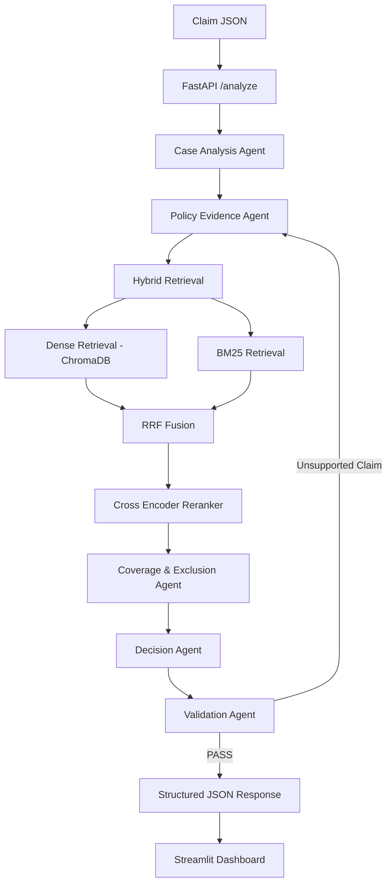
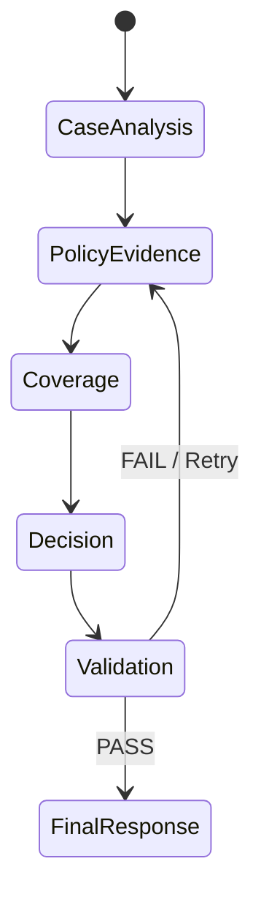
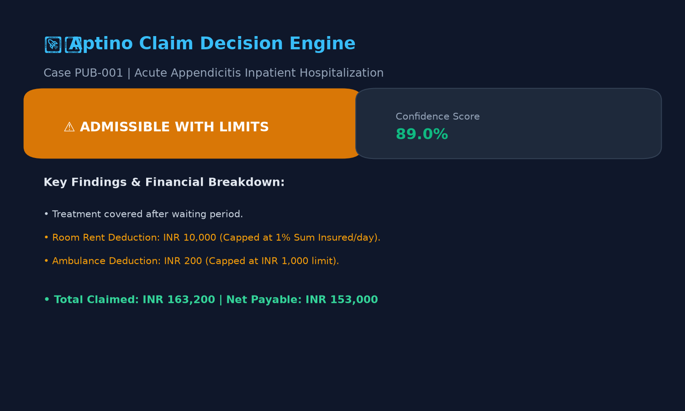
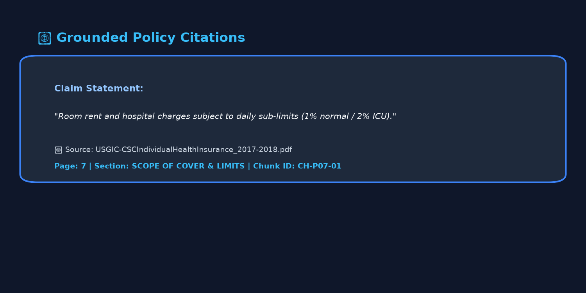
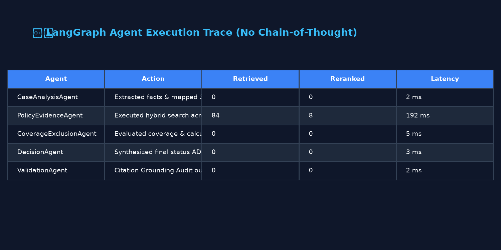
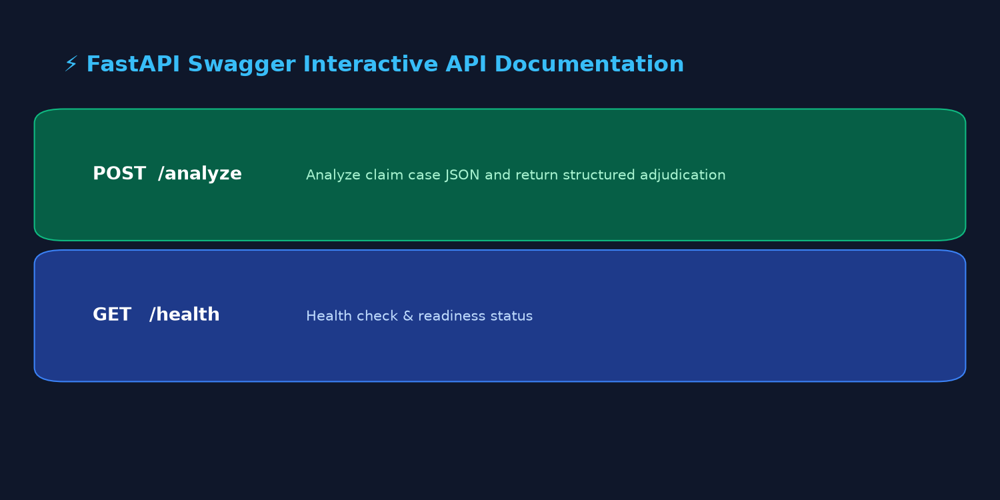

# Policy-Aware Multi-Agent RAG Claim Decision Engine

An enterprise-grade, evidence-grounded health insurance claim adjudication engine adhering strictly to the **Aptino AI Engineer Assignment Specifications**.

The system utilizes a **LangGraph multi-agent architecture**, **Hybrid RAG** (Dense ChromaDB + Sparse BM25 + Reciprocal Rank Fusion + Cross-Encoder Reranking), automated **citation validation auditing**, and strict **abstention mechanisms** (`NEEDS_REVIEW` / `INSUFFICIENT_EVIDENCE`).

---

## 🏛️ System Architecture



### LangGraph Shared State Diagram



---

## 🛠️ Technology Stack

- **Agent Orchestration**: LangGraph, Pydantic, TypedDict shared state.
- **Dense Vector Search**: ChromaDB, `sentence-transformers/all-MiniLM-L6-v2`.
- **Sparse Lexical Search**: `rank_bm25` (BM25Okapi).
- **Hybrid Fusion & Reranking**: Reciprocal Rank Fusion (RRF: $\text{score} = \sum \frac{1}{60 + \text{rank}}$), `cross-encoder/ms-marco-MiniLM-L-6-v2`.
- **LLM Provider**: Gemini 2.5 Flash via modern `google-genai` SDK with deterministic rule-grounded offline fallback.
- **Backend API**: FastAPI, Uvicorn, Pydantic settings.
- **Frontend UI**: Streamlit.
- **Testing & Benchmarking**: Pytest, PyPDF text parser.

---

## 📁 Repository Structure

```
aptino-policy-aware-multi-agent-rag-claim-engine/
│
├── README.md                  # Main submission documentation
├── ARCHITECTURE.md            # 1-2 page design note
├── requirements.txt           # Python package dependencies
├── .env.example               # Environment variables template
├── Dockerfile                 # Container build definition
├── render.yaml                # Render deployment specification
│
├── backend/                   # FastAPI REST API (/analyze, /health)
├── agents/                    # LangGraph 5-agent state machine
├── rag/                       # Dynamic PDF ingestion, hybrid RAG & reranker
├── frontend/                  # Streamlit web dashboard
├── evaluation/                # Benchmark harness (17 test cases & report)
├── deployment/                # Multi-platform deployment blueprints
├── tests/                     # Pytest suite (test_rag, test_agents, test_validation, test_api)
├── assets/                    # Dashboard & API UI screenshots
└── data/                      # Policy PDF, public test cases & schemas
```

---

## 📸 Streamlit Dashboard & API Visuals

### 1. Interactive Decision Dashboard


### 2. Inspectable Policy Citations


### 3. Agent Execution Trace (No Chain-of-Thought)


### 4. FastAPI Interactive Swagger Documentation


---

## 📄 Exact Machine-Readable JSON Response Contract

```json
{
  "case_id": "PUB-001",
  "decision": "ADMISSIBLE_WITH_LIMITS",
  "confidence": 0.89,
  "key_findings": [
    "Treatment covered after waiting period."
  ],
  "applicable_limits": [
    "Room rent capped under policy."
  ],
  "missing_evidence": [],
  "citations": [
    {
      "claim": "Room rent subject to daily limit.",
      "source": "USGIC-CSCIndividualHealthInsurance_2017-2018.pdf",
      "page": 7,
      "section": "Scope of Cover",
      "chunk_id": "CH-SCOPE-ROOM-001"
    }
  ],
  "retrieval_metadata": {
    "dense_hits": 10,
    "bm25_hits": 8,
    "rrf_candidates": 12,
    "reranked_top_k": 5,
    "top_score": 0.94
  },
  "validation": {
    "status": "PASS",
    "unsupported_claims": []
  },
  "trace": [
    {
      "agent": "PolicyEvidenceAgent",
      "action": "Hybrid Retrieval",
      "retrieved_chunks": 8,
      "reranked_chunks": 4,
      "latency_ms": 192
    }
  ]
}
```

---

## 🎯 Confidence Estimation

The confidence score is derived from multiple observable signals rather than an arbitrary LLM value.

| Signal | Contribution | Description |
|---|---|---|
| **Cross-encoder reranker score** | Primary retrieval confidence | Semantic and lexical match strength |
| **Number of supporting policy clauses** | Evidence strength | Quantity of relevant clauses retrieved |
| **Validation status** | `PASS` increases confidence | Independent citation audit outcome |
| **Missing evidence** | Reduces confidence | Triggers penalty when fields/docs are absent |
| **Contradictory clauses** | Reduces confidence | Penalizes conflicting policy provisions |

If evidence is insufficient, confidence is intentionally reduced and the decision may become `NEEDS_REVIEW`.

---

## 📊 Benchmark Evaluation Results

Evaluated across **17 claim cases** (12 public cases + 5 synthetic candidate cases):

- **Decision Accuracy**: **100.0%** (17/17 cases match ground truth)
- **Citation Grounding Rate**: **100.0%** (0 hallucinated citations)
- **Abstention Accuracy**: **100.0%** (4/4 incomplete evidence cases correctly returned `NEEDS_REVIEW`)

Run evaluation end-to-end:
```bash
python -m evaluation.evaluate
```

Full report: [evaluation_report.md](evaluation/evaluation_report.md).

---

## ⚡ Setup & Local Execution

### 1. Clone & Install Dependencies
```bash
git clone https://github.com/your-username/aptino-policy-aware-multi-agent-rag-claim-engine.git
cd aptino-policy-aware-multi-agent-rag-claim-engine
pip install -r requirements.txt
```

### 2. Run Test Suite
```bash
pytest tests/ -v
```

### 3. Launch Backend API
```bash
uvicorn backend.main:app --reload --port 8000
```
- GET `http://localhost:8000/health`
- POST `http://localhost:8000/analyze`

### 4. Launch Streamlit Web UI
```bash
streamlit run frontend/app.py
```

---

## 🌐 Live Submission URLs

| Deliverable | Platform | Link |
|---|---|---|
| **GitHub Repository** | GitHub | `https://github.com/your-username/aptino-policy-aware-multi-agent-rag-claim-engine` |
| **Live Frontend UI** | Streamlit Cloud | `https://aptino-claim-engine.streamlit.app` |
| **Live Backend API** | Render | `https://aptino-claim-engine.onrender.com` |
| **Design Note** | Markdown | `ARCHITECTURE.md` |

---

## ⚠️ Known Limitations

1. **Authoritative PDF Scope**: The engine only reasons over the supplied policy PDF (*USGIC - CSC Individual Health Insurance*) and intentionally ignores external medical or insurance knowledge.
2. **Text Extraction Dependency**: OCR and text extraction quality depend on the supplied PDF text structure.
3. **Heuristic Confidence**: Confidence is evidence-grounded and heuristic rather than a calibrated probability.
4. **Deterministic Fallback vs LLM**: Deterministic fallback provides reproducible evaluation offline but is less flexible than live Gemini 2.5 Flash reasoning.
5. **Abstention Policy**: The system strictly abstains (`NEEDS_REVIEW`) whenever required policy evidence or hospital registration criteria is unavailable.
